# SOC-Automation-Lab

# SOC Automation: Integrating Wazuh Alerts with Shuffle - A Hands-On Guide

## Introduction
Welcome to this hands-on guide designed for SOC analysts looking to gain practical experience in Security Operations Center (SOC) automation. In this guide, we’ll take you through the step-by-step process of automating Wazuh alerts using Shuffle. By the end, you’ll have valuable skills to enhance your SOC capabilities, including setting up an automated workflow to handle unsuccessful SSH login attempts on an Ubuntu server.

Wazuh is an open-source security monitoring platform that provides threat detection, integrity monitoring, incident response, and compliance. Shuffle is an open-source security orchestration, automation, and response (SOAR) platform that helps automate repetitive tasks and streamline workflows

## Objectives
Set up an automated SOC environment. Configure Wazuh for threat detection and Shuffle for workflow automation. The focus will be on automatically blocking IP addresses attempting unauthorized SSH logins.

## Prerequisites
- **Password Manager**: You'll be creating multiple accounts and VMs, so a password manager is highly recommended.
- **Cloud Account**: Choose a cloud provider like AWS, GCP, Digital Ocean, or Vultr (whichever offers a free tier for this exercise)
- **Two Ubuntu VMs**:
1. Wazuh Manager
2. Victim Ubuntu VM (for SSH attack simulation)

### Setting Up the Environment

##### 1. Create a Virtual Network
- Create a virtual network in your cloud platform.
- Allow only your public IP in the firewall to secure access.

##### 2. Create Wazuh Manager VM
1. **Choose Ubuntu 22.04**: For the Wazuh Manager.
2. **Update Wazuh manager server**:
   ```bash
   sudo apt-get update && apt-get upgrade -y
   ```
3. **Configure Firewall in cloud portal**: Open ports 1514 and 1515 (for Wazuh endpoint agents), and open port 55000 (for integration with Shuffle).
4. **Configure Firewall in Wazuh manager server**: Open ports 1514, 1515, and 55000 for Wazuh agent and Shuffle integration.
    ```bash
    ufw allow 1514/tcp
    ufw allow 1514/udp
    ufw allow 1515/tcp
    ufw allow 1515/udp
    ufw allow 55000/tcp
    ufw allow 55000/udp
    ```
5. **Install Wazuh Manager**: Note: Always use the latest command from the Wazuh documentation to ensure compatibility.
    ```bash
    curl -sO https://packages.wazuh.com/4.9/wazuh-install.sh && sudo bash ./wazuh-install.sh -a
    ```
6. **Save Credentials**: After installation, save the credentials displayed for the Wazuh web portal admin credentials in your password manager. If you forget, you can retrieve them using:
    ```bash
    sudo tar -O -xvf wazuh-install-files.tar wazuh-install-files/wazuh-passwords.txt
    ```
7. **Access the Wazuh Dashboard**: Sign in to the Wazuh Manager using its public IP address. Navigate to the “Deploy new agent” and select the operating system, which in this case is Linux. Add the public IP address of the Wazuh manager and copy the command to install the Wazuh endpoint agent. Save this command for later use when we create the victim Ubuntu VM.

#### 3. Create Victim Ubuntu VM
1. **Update System**:
    ```bash
    sudo apt-get update && apt-get upgrade -y
    ```
2. **Install Wazuh Agent**: Use the command copied from the Wazuh dashboard earlier:
    ```bash
    wget https://packages.wazuh.com/4.x/apt/pool/main/w/wazuh-agent/wazuh-agent_4.9.0-1_amd64.deb && sudo WAZUH_MANAGER='WAZUH-PUBLIC-IP' dpkg -i ./wazuh-agent_4.9.0-1_amd64.deb
    ```
3. **Start Wazuh Agent**: Use these commands to start and check the status of the Wazuh agent.
    ```bash
    sudo systemctl daemon-reload
    sudo systemctl enable wazuh-agent.service
    sudo systemctl start wazuh-agent.service
    sudo systemctl status wazuh-agent.service
    ```
4. **Verify Agent**: Go back to the Wazuh web portal and confirm that the agent appears in the Wazuh dashboard.

### Configure Wazuh Manager to log all events
- **Edit Configuration**:
    ```bash
    sudo nano /var/ossec/etc/ossec.conf
    ```
    Enable logging by setting both `logall` and `logall_json` to `yes` in the configuration file.
  
  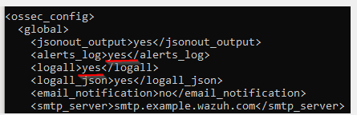
  
    After editing the configuration file, restart the Wazuh Manager and check its status:
    ```bash
    sudo systemctl restart wazuh-manager.service
    sudo systemctl status wazuh-manager.service
    ```  

### Set Up Shuffle
Now let's sign up for Shuffle at shuffler.io.
1. **Create Workflow**: After signing in, click on “New Workflow.” Give it a name, something like “SOC Automation,” and then click “Save.”
2. **Add Webhook Trigger**: 
   - Click on “Triggers” at the bottom left corner of your screen, select “Webhook,” and drag it into the middle of your workflow.
   - Click on the "Webhook app" and rename it Wazuh-Alerts.
     
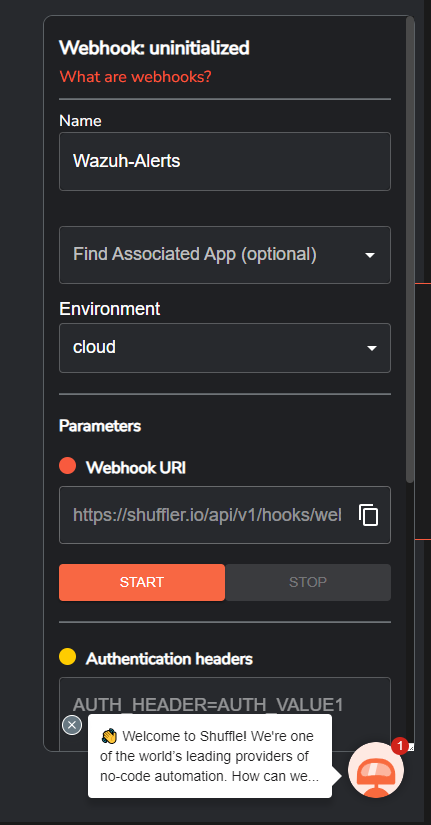
     
3. **Configure the Change Me App**
   - Click on the Change Me app.
   - Change the name to Repeater.
   - In the Call box, delete "Hello World" text. Next click on the plus icon and select on "Execution Argument".
   - Save the workflow.

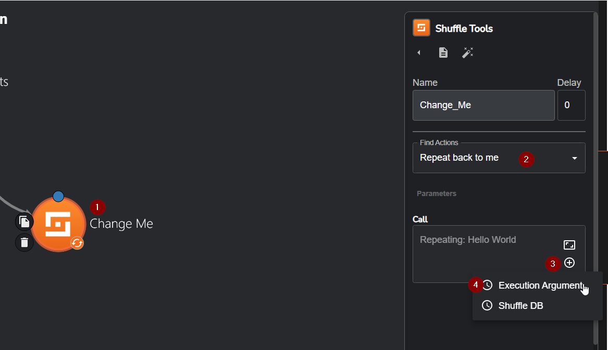  
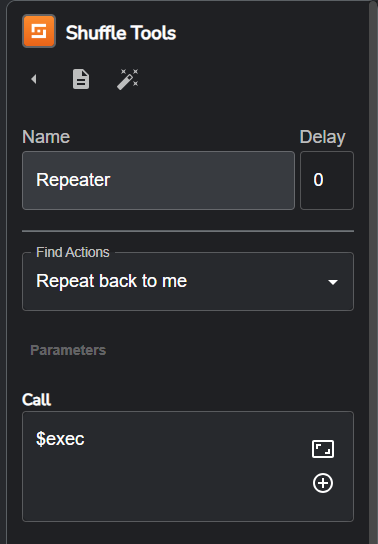
     
4. **Add Shuffle Integration**: Add the integration tag into the Wazuh configuration file.
   - Navigate back to the Webhook app "Wazuh-Alerts" and copy the URL. Then, paste this URL into the Shuffle integration tag within the Wazuh manager configuration file.
    ```xml
    <integration>
      <name>shuffle</name>
      <hook_url>http://<YOUR_SHUFFLE_URL></hook_url>
      <level>5</level>
      <alert_format>json</alert_format>
    </integration>
    ```
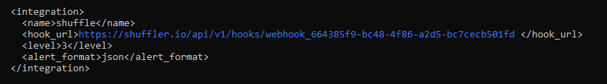

    After editing the configuration file, restart the Wazuh Manager and check its status:
    
```bash
sudo systemctl restart wazuh-manager.service
sudo systemctl status wazuh-manager.service
```

4. **Testing Wazuh Alerts Forwarding to Shuffle**
   - Return to Shuffle, select the Webhook app ‘Wazuh-Alerts’, and click the "Start" button.
   - You should now see a lot of alerts coming from the victim VM because the SSH port is open.
#### Filter Specific Alerts
1. **Identify Failed SSH Attempts**: In Shuffle, look for alerts with "User Login Failed".
   - For this lab we will chose rule id "5503" "User Login Failed".
2. **Modify Integration**: Replace `<level>3</level>` with `<rule_id>5503</rule_id>` to only forward alerts with "User Login Failed":

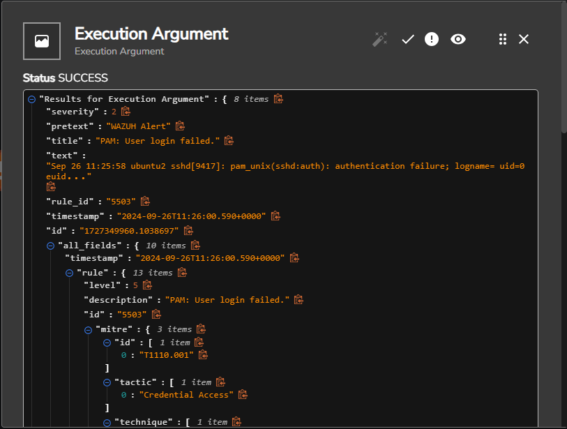

    ```xml
    <integration>
      <name>shuffle</name>
      <hook_url>http://<YOUR_SHUFFLE_URL>/api/v1/hooks/<HOOK_ID></hook_url>
      <rule_id>5503</rule_id>
      <alert_format>json</alert_format>
    </integration>
    ```
    
### Configuring HTTP App for Wazuh API Authentication

- Add the HTTP app and drag it into your workflow.
- Rename it to "API_Auth".
- Change the find action to `curl` and input:

    ```bash
    curl -u <username>:<password> -k -X GET "https://<YOUR_WAZUH_MANAGER_IP>:55000/security/user/authenticate?raw=true"
    ```
- Use this command in your wazuh manager to find the API user password:
    ```bach
    sudo tar -O -xvf wazuh-install-files.tar wazuh-install-files/wazuh-passwords.txt
    ```  
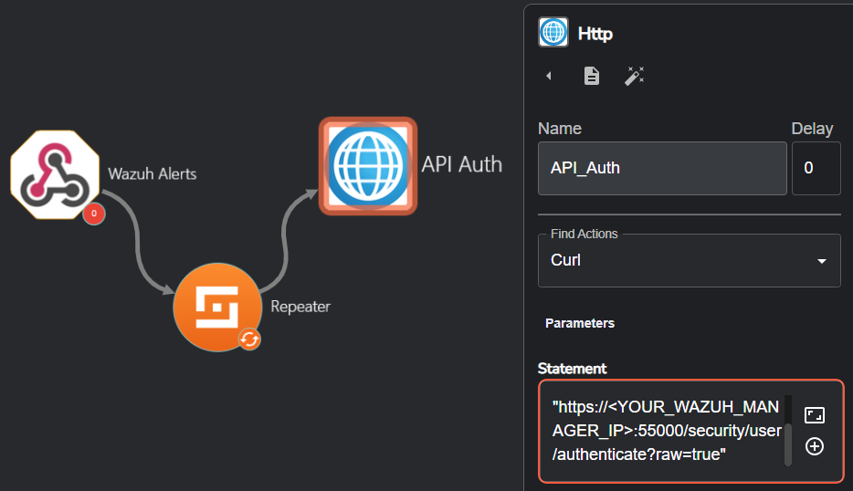

### Set Up Active Response in Wazuh Manager

**Configure Active Response**: Modify the active-response in the Wazuh configuration file. There should be a sample when you scroll all the way down.

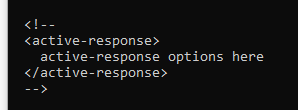

```xml
<active-response>
  <command>firewall-drop</command>
  <location>local</location>
  <level>3</level>
  <timeout>no</timeout>
</active-response>
```
   - Restart and check the status of the Wazuh Manager:
    
```bash
sudo systemctl restart wazuh-manager.service
sudo systemctl status wazuh-manager.service
```

### Adding Wazuh App to Shuffle
1. **Add Wazuh App**: 
   - Rename it to Wazuh.
   - Change the Find Actions to `Run command`.
   - APIkey: click on the plus icon and chose the HTTP App `API_Auth`.
   - URL: chose the public IP address of your wazuh manager.
   - SSL verify: set to False
   - Agent List: click on the plus icon and hover over `Execution Argument` and click on `Agent ID`.
   - Wait for complete: set to True
   - Body: use the following JSON:
    ```json
    {
      "alert": {
        "data": {
          "srcip": "$exec.all_fields.data.srcip"
        }
      },
      "command": "firewall-drop0"
    }
    ```
   - To find the `Source IP`, hover over `Execution Argument`, scroll down to `data srcip`, click on it, save it, and input this into the JSON file.

  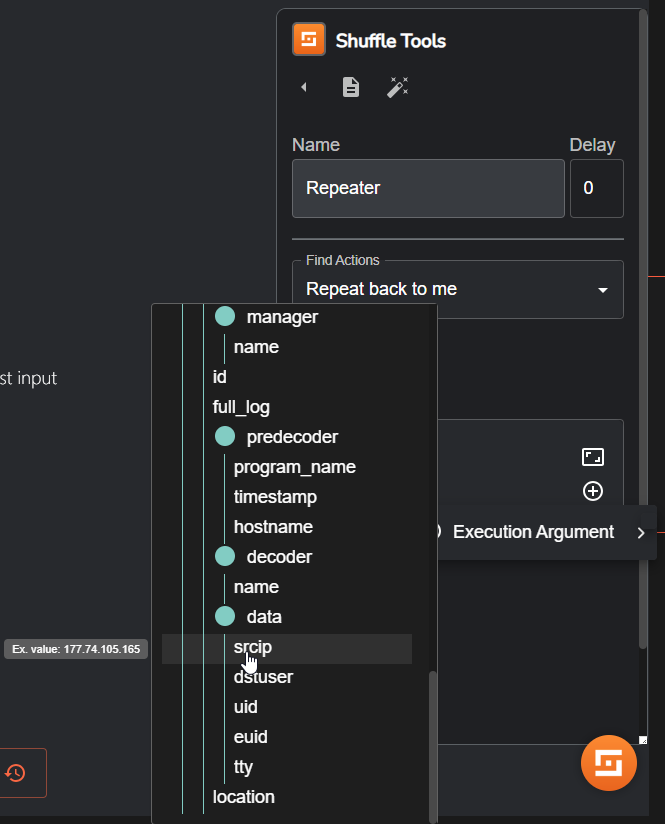
 
   - To locate the `command`, SSH into the Wazuh manager, navigate to the /var/ossec/bin directory, and use the `ls` command to list all the available files.
   - Execute the agent_control binary to view the available active response command.

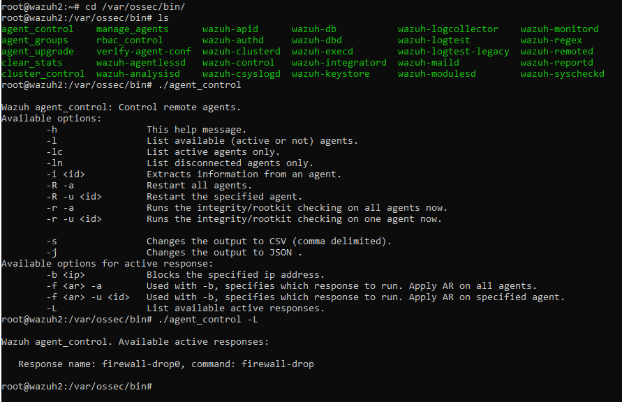

   - Save your workflow.

### User input
   - Navigate to the `Trigers` tab in Shuffle and drag the `User Input` app in the workflow.
   - Rename it to SOC Analyst Input.
   - In the information box, specify your question. For example, 'Do you want to block this IP address?' Then insert the source IP address obtained from the `Execution Argument` as done previously.
   - Choose "Email" as the response method.
   - Save your workflow.

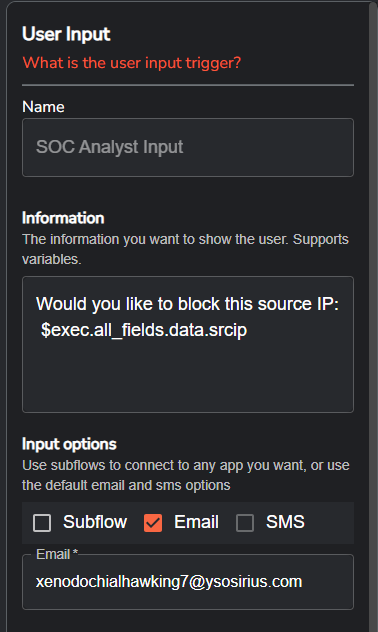

### Workflow
For every failed SSH login attempt to the victim VM, the SOC analyst will receive an email prompting them to either block or allow the source IP. The email will display the source IP address, and by clicking "True", the active response command will be triggered to drop the attacker's IP address.

### Verification
To verify that failed SSH attempts trigger the workflow and confirm that the IP address is blocked, check the `iptables` on the victim VM:
   ```bash
   sudo iptables --list
   ```

## Conclusion
You have set up an automated active response workflow where failed login attempts are detected by Wazuh and, and SOC analysts are notified via email to take action by Shuffle. This setup is just the beginning of more advanced SOC automation labs and techniques. Stay tuned for future labs where we'll dive deeper.
